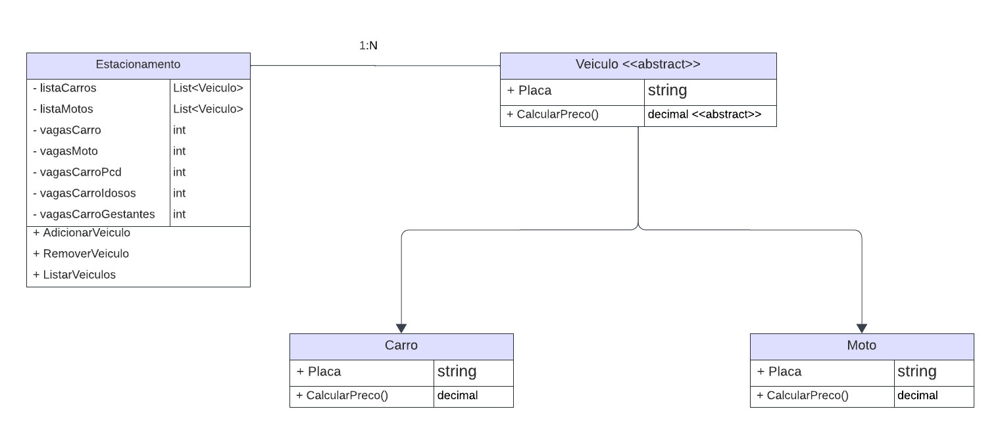

# DIO - Trilha .NET - Fundamentos
www.dio.me

## Desafio de projeto
Para este desafio, você precisará usar seus conhecimentos adquiridos no módulo de fundamentos, da trilha .NET da DIO.

## Contexto
Você foi contratado para construir um sistema para um estacionamento, que será usado para gerenciar os veículos estacionados e realizar suas operações, como por exemplo adicionar um veículo, remover um veículo (e exibir o valor cobrado durante o período) e listar os veículos.

## Proposta
Você precisará construir uma classe chamada "Estacionamento", conforme o diagrama abaixo:

A classe contém três variáveis, sendo:

**precoInicial**: Tipo decimal. É o preço cobrado para deixar seu veículo estacionado.

**precoPorHora**: Tipo decimal. É o preço por hora que o veículo permanecer estacionado.

**veiculos**: É uma lista de string, representando uma coleção de veículos estacionados. Contém apenas a placa do veículo.

A classe contém três métodos, sendo:

**AdicionarVeiculo**: Método responsável por receber uma placa digitada pelo usuário e guardar na variável **veiculos**.

**RemoverVeiculo**: Método responsável por verificar se um determinado veículo está estacionado, e caso positivo, irá pedir a quantidade de horas que ele permaneceu no estacionamento. Após isso, realiza o seguinte cálculo: **precoInicial** * **precoPorHora**, exibindo para o usuário.

**ListarVeiculos**: Lista todos os veículos presentes atualmente no estacionamento. Caso não haja nenhum, exibir a mensagem "Não há veículos estacionados".

Por último, deverá ser feito um menu interativo com as seguintes ações implementadas:
1. Cadastrar veículo
2. Remover veículo
3. Listar veículos
4. Encerrar

## Solução
- Propriedades novas para a classe Estacionamento: listaCarros (List<Veiculo>); listaMotos (List<Veiculo>); vagasCarro (int); vagasMoto (int); vagasCarroPcd(int); vagasCarroIdosos(int); vagasCarroGestantes(int);
- Método AdicionarVeiculo() na classe Estacionamento foi complementado. Agora o programa pergunta ao usuário que tipo de veículo ele deseja estacionar (Moto ou Carro), depois pergunta qual a placa do veículo e se necessita de acessibilidade (PCD, Idosos e Gestantes);
- Método RemoverVeiculo() na classe Estacionamento foi complementado. Agora é solicitado ao usuário a quantidade de horas que o veículo ficou estacionado, e a depender do tipo do veículo os valores do cálculo são atualizados antes do cálculo do valor total;
- Método ListarVeiculos() na classe Estacionamento foi complementado. Agora uma lista com todos os veículos é exibida em um laço de repetição. Abaixo da lista é exibida a quantidade de vagas restante para cada tipo de veículo e critérios de acessibildiade;
- Classe Veiculo criada, contendo a propriedade Placa e o método CalcularPreco();
- Classe Carro criada, herdando a propriedade placa e o método CalcularPreco() da classe Veiculo, que é sobrescrito com os valores de estacionamento para carros;
- Classe Moto criada, herdando a propriedade placa e o método CalcularPreco() da classe Veiculo, que é sobrescrito com os valores de estacionamento para motos.
